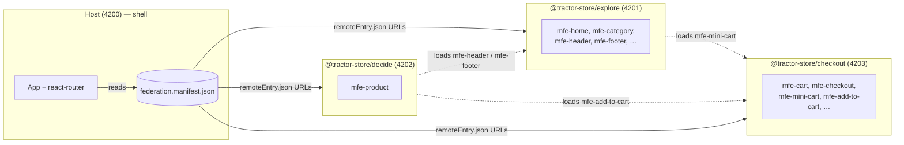

# Tractor Store — Documentation

The Tractor Store is a four-app micro-frontend (MFE) system: a thin
**host** shell plus three independently-deployed **remotes**, each
owned by a separate team. The host owns the URL and the page chrome;
the remotes ship UI as web components and link to each other through
*intent IDs* instead of hard-coded URLs. All composition happens at
runtime — there is no build-time wiring between apps.

The runtime is [Native Federation v4][nf], the standards-based
successor to webpack Module Federation. It is built on ECMAScript
Modules and Import Maps, so what we ship is plain browser-native
code with a small orchestration layer on top.

[nf]: https://native-federation.com/

## New to micro-frontends?

A micro-frontend architecture splits a single web application into
smaller apps that can be built, tested, and deployed independently.
Each team owns its slice end-to-end and the browser composes them at
runtime.

This project follows the [Tractor Store Blueprint][blueprint] — a
reference scenario for comparing MFE techniques across frameworks.
The teams are named for what they do in the customer journey
(**Explore**, **Decide**, **Checkout**), not for technical layers.
That vertical split is the canonical micro-frontends decomposition
described on [micro-frontends.org][mfo].

Three ideas carry the weight in this repo:

1. **Custom elements** (web components). Every UI fragment a remote
   exposes is registered as a `<mfe-*>` HTML tag. The host (or any
   other remote) places that tag in the DOM and the browser does the
   rest. The contract is plain HTML — no React component, hook, or
   context crosses team boundaries. Packaging is done once by
   `defineMfe` from `@react-internal/mfe-runtime`.
2. **A central event bus** (`window.__NF_REGISTRY__`). Remotes
   publish and subscribe to small, *typed* channels instead of
   calling each other directly. Each channel is defined once with
   `defineChannel<Payload>(name)` in `@react-internal/event-bus`;
   emitter and listener then share the same compile-time contract.
   Navigation, store selection, and cart sync all ride on this bus.
3. **Intent-based navigation.** A link in *decide* that should open
   the cart never types `'/checkout/cart'`. It uses the
   `<NavigateLink>` component (or `useNavigateTo()` hook) with the
   intent `'checkout.cart'`, and the host translates that to a URL.
   A team can rename its routes without touching anyone else's code.

Together these three keep the apps decoupled. The rest of this doc
set explains how each piece is implemented.

[blueprint]: https://github.com/neuland/tractor-store-blueprint
[mfo]: https://micro-frontends.org/

## At a glance

The manifest is the only static "wiring": every app fetches it at
startup and uses it to locate the others. The dotted lines are
*cross-remote fragment loads* — a remote can mount another remote's
custom element inside its own page without going through the host.

## Read next

- **[Architecture](./architecture.md)** — what the host owns, what
  each remote owns, and the three decoupling mechanisms (custom
  elements, the event bus, intent-based navigation) plus how shared
  libraries are scoped.
- **[Navigation](./navigation.md)** — the intent-based navigation
  system and why it is the load-bearing piece of the host/remote
  decoupling.
- **[Features](./features.md)** — what each team ships, the
  fragments they expose, the events they emit, and the cross-remote
  dependencies between them.

## Where does X live?

| Concern                                    | File / module                                                                       |
| ------------------------------------------ | ----------------------------------------------------------------------------------- |
| Host bootstrap & federation init           | `apps/host/src/main.tsx`                                                            |
| Host React tree + RouterProvider           | `apps/host/src/app/bootstrap.tsx`                                                   |
| Host AppContext (env, manifest, loader)    | `apps/host/src/app/context.tsx`                                                     |
| Building routes + wiring the registry      | `apps/host/src/app/nav/setup-shell-nav.ts`, `remote-routes.tsx`                     |
| Loading a remote's custom element          | `libs/federation/src/lib/federation.ts` (`createSliceLoader`)                       |
| Tag → remote name index                    | `libs/federation/src/lib/slice-index.ts` (`__NF_SLICE_INDEX__`)                     |
| Host route → element mount                 | `apps/host/src/app/RemoteShell.tsx`                                                 |
| Cross-MFE link component                   | `libs/navigation/src/lib/navigate-link.tsx` (`<NavigateLink>`)                      |
| Cross-MFE navigation hook                  | `libs/navigation/src/lib/use-navigate-to.ts` (`useNavigateTo`)                      |
| In-remote intent resolver                  | `libs/navigation/src/lib/nav-resolver.ts` (`resolveIntent`, `subscribeNavIntents`)  |
| Host intent → URL resolution               | `apps/host/src/app/nav/nav-registry.ts`                                             |
| Event-bus channel factory                  | `libs/event-bus/src/lib/event-bus-setup.ts` (`defineChannel`)                       |
| Navigation channels                        | `libs/event-bus/src/lib/nav-event-bus.ts` (`nav:navigate`, `nav:intents`)           |
| Store-selected channel                     | `libs/event-bus/src/lib/store-event-bus.ts` (`store:selected`)                      |
| Cross-instance cart sync                   | `libs/event-bus/src/lib/cart-event-bus.ts` (`cart:updated`, `emitCartUpdated`)      |
| Cart state in checkout                     | `apps/checkout/src/cart/cart-store.ts`                                              |
| Custom-element wrapper for React           | `libs/mfe-runtime/src/lib/define-mfe.tsx` (`defineMfe`)                             |
| Per-remote env + loader context            | `libs/mfe-runtime/src/lib/remote-context.tsx` (`useRemoteEnv`, `useRemoteLoader`)   |
| Shadow-aware style hook                    | `libs/ui/src/lib/shadow-root-context.tsx` (`useScopedStyles`, `ShadowRootProvider`) |
| Path/query helpers (shared)                | `libs/url/src/lib/path-template.ts`, `query.ts`, `route-params.ts`                  |
| `NavPayload` / `RouteParams` types         | `libs/url/src/lib/nav-payload.ts`, `route-params.ts`                                |
| Remote bootstrap (custom-element)          | `apps/<remote>/src/features/<feature>/bootstrap.tsx`                                |
| Remote nav contribution                    | `apps/<remote>/src/core/nav-contribution.ts`                                        |
| Federation config (per app)                | `apps/<app>/federation.config.mjs`                                                  |
| Runtime remote discovery                   | `apps/<app>/public/federation.manifest.json`                                        |
| Per-environment values                     | `apps/<app>/public/env.config.json`                                                 |
| Team boundary visualisation overlay        | `cdn-content/cdn/js/helper.js`                                                      |
