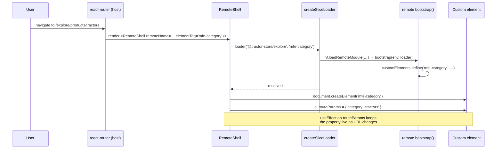
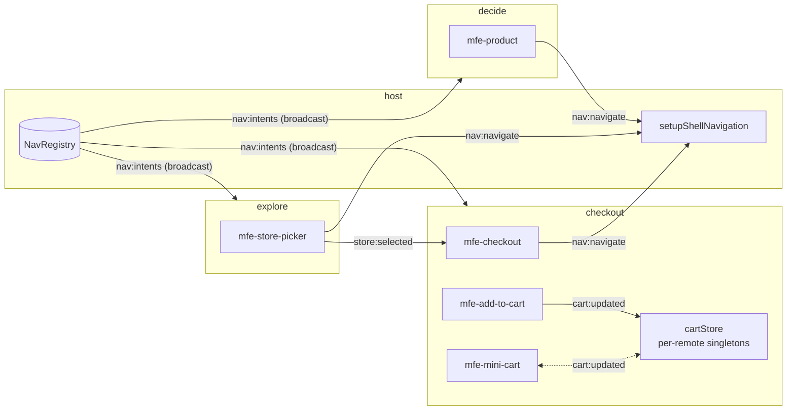
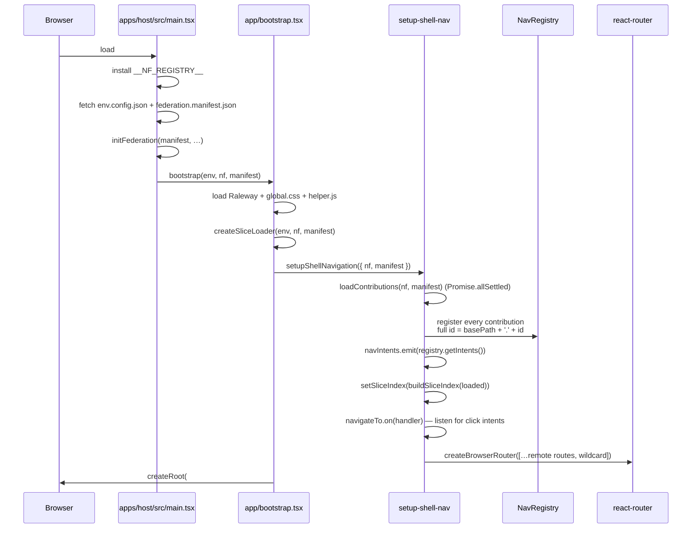

# Architecture

This document explains the contract between the host and the remotes —
what each side owns, where the boundary sits, and how the three
decoupling mechanisms (custom elements, the event bus, intent-based
navigation) make runtime composition possible without coupling the apps
together. A short note on shared libraries closes it out.

## Why decoupling matters

Three teams ship three React applications into one page. The
architecture has one job: keep those teams independent. *Independent*
means a team can rename a route, swap an internal component, or roll a
backend change forward without coordinating with the other teams.

Whenever two MFEs talk to each other directly — by importing types,
sharing a React context, or calling each other's hooks — they pick up
a hidden dependency that turns "deploy whenever you want" into "deploy
whenever the other team is ready". The architecture below avoids that
by inserting an explicit, stable contract at every place where the
apps meet.

> Michael Geers, *micro-frontends.org*: "*Isolate Team Code — Don't
> share a runtime, even if all teams use the same framework. Build
> independent apps that are self-contained.*"

## The two-layer model

Two layers, with a small, explicit contract between them.

```mermaid
flowchart LR
    subgraph HostSide["HOST"]
        direction TB
        HA["Owns the URL<br/>(react-router-dom)"]
        HB["Owns page chrome<br/>(layout, error UI)"]
        HC["Loads remotes via<br/>Native Federation"]
        HD["Holds the<br/>NavRegistry"]
    end

    subgraph RemoteSide["REMOTE (×3)"]
        direction TB
        RA["Self-contained<br/>React app per remote"]
        RB["Ships fragments as<br/>mfe-* custom elements"]
        RC["Declares routes via<br/>nav-contribution"]
        RD["Reads route data via<br/>routeParams prop"]
    end

    HostSide e1@==>|"federation.manifest.json"| RemoteSide
    HostSide e2@==>|"loads nav-contribution<br/>+ mfe-* elements"| RemoteSide
    RemoteSide e3@-->|"emits nav:navigate<br/>via __NF_REGISTRY__"| HostSide

    e1@{animate: true}
    e2@{animate: true}
    e3@{animate: true}
```



The contract has exactly four touchpoints:

1. **`federation.manifest.json`** — the host's list of remote names →
   entry URLs, fetched at startup.
2. **`nav-contribution`** — a module each remote *exposes* that
   declares its base path and the intents (routable destinations) it
   owns.
3. **`mfe-*` custom elements** — the actual UI fragments, also exposed
   via federation. The host instantiates them with
   `document.createElement`.
4. **`routeParams`** — a single property the host writes onto a
   mounted custom element, carrying parsed path and query parameters.

Nothing else is shared at the boundary. There is no `import` from a
remote in host code, no React context crossing the line, no shared
router state.

## The three decoupling mechanisms

### 1. Custom elements as the integration surface

A remote does not ship React components for the host to import. It
ships **custom elements** (web components) registered under stable
`mfe-*` tags. The packaging is handled once by
`@react-internal/mfe-runtime`'s `defineMfe` helper.

A typical feature bootstrap
(`apps/explore/src/features/header/bootstrap.tsx`):

```tsx
import { defineMfe } from '@react-internal/mfe-runtime';
import { Header } from './Header';

export const bootstrap = defineMfe('mfe-header', Header);
```

`defineMfe(tag, Component, options?)` returns the `bootstrap(env,
loader)` function the federation slice loader expects. When called,
it registers an `HTMLElement` subclass for the tag
(`libs/mfe-runtime/src/lib/define-mfe.tsx:63`) that:

- attaches an open shadow root,
- creates a `react-dom/client` root inside it,
- renders the component wrapped in `<StrictMode><ErrorBoundary><ShadowRootProvider><RemoteContextProvider>` — so React-side concerns (error boundaries, scoped styles, env+loader access) work consistently inside every fragment,
- listens for `routeParams` property writes from the host and
  re-renders,
- mirrors `observedAttributes` onto the component as string props.

The browser's standard custom-element machinery then does the
integration. Three consequences worth calling out:

- **Plain HTML is the contract.** A consumer drops `<mfe-cart>` in
  JSX (or any other template language); nothing else is required. No
  React component type, no hook, no context crosses the boundary.
- **One React root per fragment.** Each mounted `<mfe-*>` gets its
  own `createRoot()` inside a shadow root. Style and DOM are
  isolated from siblings — the explore *team* has one app, but the
  page hosts many independent React trees.
- **Bootstrap is idempotent.** `defineMfe` short-circuits if the tag
  is already defined (`define-mfe.tsx:52`), and `createSliceLoader`
  guards on `customElements.get(exposedModule)` too
  (`libs/federation/src/lib/federation.ts:58`). It is safe to request
  the same fragment from many places.

> Cam Jackson, *martinfowler.com*: "*Each micro frontend is to define
> an HTML custom element for the container to instantiate, instead of
> defining a global function for the container to call.*"

#### Loading a fragment: `LoadRemoteSlice`

Every app receives the same closure for loading remote fragments
(`libs/federation/src/lib/federation.ts:24`):

```ts
export interface LoadRemoteSlice {
  (remoteName: string, exposedModule: string): Promise<void>;
  prefetchElement(tag: string): Promise<void>;
}
```

The loader is created once in the host
(`apps/host/src/app/bootstrap.tsx:53`) and shared with remotes when
they bootstrap. Two ways to use it:

- **`loader(remoteName, exposedModule)`** — the explicit form. The
  host's `RemoteShell` calls this when a route activates.
- **`prefetchElement(tag)`** — the convenient form for cross-remote
  warm-up. A feature that knows it will render `<mfe-mini-cart>`
  somewhere on the page can call `prefetchElement('mfe-mini-cart')`
  without knowing which remote owns it; the runtime looks the tag up
  in a global index (more below) and resolves the owning remote
  itself.

Both end in the same place: `nf.loadRemoteModule(...)` resolves to
the federation chunk, and the module's `bootstrap(env, loader)` runs
exactly once — registering the custom element and (the second time
through) wiring it into the runtime.

The loader passes *itself* into the remote's bootstrap as the second
argument. That detail is how cross-remote loads work even when the
host is not in the picture: an explore feature mounting
`<mfe-mini-cart>` (from checkout) can call `prefetchElement('mfe-mini-cart')`
and recursion gets it done.

#### The slice index (`window.__NF_SLICE_INDEX__`)

`prefetchElement` only works because the host publishes a `tag →
remoteName` map at boot. Each remote's `nav-contribution` declares
its routed `intents[].element` plus a `chromeElements` array for any
non-routed tags it exposes (`mfe-header`, `mfe-mini-cart`, etc.).
The host folds both into a single `Map` and writes it to
`window.__NF_SLICE_INDEX__` (`apps/host/src/app/nav/setup-shell-nav.ts:20`).
Inside `prefetchElement`, `findRemoteForElement(tag)` reads that map
(`libs/federation/src/lib/slice-index.ts:21`).

The pay-off: an explore feature that wants to render `<mfe-mini-cart>`
never names the string `'@tractor-store/checkout'`. The chrome list
in checkout's `nav-contribution` is the canonical owner record;
consumers only know the tag.

In standalone-fragment mode (a single remote booted on its own port
without the host), the index is unset and `prefetchElement` is a
no-op — the custom element is the only thing that gets loaded, and
sibling tags resolve to whichever remote happens to be running.

#### Why a single `routeParams` property and not attributes

`HTMLElement` reserves a long list of property names (`id`, `slot`,
`title`, `hidden`, `style`, …). If the host wrote each route param as
its own attribute it would silently collide with intrinsics — set
`<mfe-cart id="abc">` and the DOM has already claimed `id`. Instead,
all params land under one well-known property (`routeParams`), and
the React component receives them as a single prop via the
`MfeElement.routeParams` setter (`define-mfe.tsx:72`). The remote
reads them through helpers in `libs/url/src/lib/route-params.ts`
(`param`, `requiredParam`, `paramList`).

For genuinely *static* attributes (e.g. `<mfe-recommendations skus="A,B,C">`),
`defineMfe` accepts an `observedAttributes` option that mirrors them
onto the component as string props.

#### How a route activation lands a custom element on the page



`RemoteShell` (`apps/host/src/app/RemoteShell.tsx`) follows exactly
this script: it reads `remoteName` + `elementTag` from props (passed
in by the route definition), calls the loader, creates the element,
and pipes `useParams()` + `useSearchParams()` into a single
`routeParams` object. While the slice is loading it renders a
`<Spinner>`; if the load fails it renders an error message. An
`ErrorBoundary` wraps the whole thing.

#### A note on Shadow DOM and styles

Every fragment lives inside its own shadow root, so CSS does not
leak across teams. But the shared UI lib (`Button`, `Spinner`,
`ErrorBoundary`) is consumed inside those shadow roots *and* in the
host shell's light DOM (tests, the host's own UI). The UI lib
resolves this with one hook
(`libs/ui/src/lib/shadow-root-context.tsx:25`):

```ts
export function useScopedStyles(id: string, css: string): void {
  const root = useContext(ShadowRootContext);
  if (root) adoptStyles(root, id, css);
  else ensureStyles(id, css);
}
```

Inside a shadow (the common case — `defineMfe` provides
`ShadowRootProvider`) the CSS is adopted as a constructable stylesheet
on that root. Outside one (host shell, jsdom tests) it falls back to
a deduplicated `<style>` tag in `document.head`. Components don't
need to know which case they're in; they just call `useScopedStyles`.

### 2. The event bus (`window.__NF_REGISTRY__`)

Custom elements solve composition: a remote can mount another remote's
UI. But composition alone is not enough — the remotes also need to
*talk* to each other. They do that through a small, shared event bus
that the host sets up before React bootstraps.

The bus lives on `window.__NF_REGISTRY__` and is created at the top of
`apps/host/src/main.tsx:23`:

```ts
(function (): void {
  const registry = createRegistry({
    maxStreams: 20, maxEvents: 1, removePercentage: 0.25,
  });
  window.__NF_REGISTRY__ = Object.freeze(registry());
})();
```

The IIFE runs *before* the dynamic `import('./app/bootstrap')` below
it — important, because the bootstrap module pulls in
`@react-internal/event-bus`, and every channel handle defined there
fails fast if the bus is missing
(`libs/event-bus/src/lib/event-bus-setup.ts:15`).

It is a pub/sub object provided by the Native Federation orchestrator
with two primitives, `emit(name, data)` and `on(name, handler)`. On
top of that primitive, `@react-internal/event-bus` introduces a tiny
abstraction so that *channels* carry both their name **and** their
payload type in one place:

```ts
export interface ChannelHandle<TPayload> {
  readonly name: string;
  emit(payload: TPayload): void;
  on(handler: (payload: TPayload) => void): () => void;
}

export const defineChannel = <TPayload>(name: string): ChannelHandle<TPayload> => {
  requireBus(name);
  return Object.freeze({
    name,
    emit: (payload) => requireBus(name).emit<TPayload>(name, payload),
    on:   (handler) => requireBus(name).on<TPayload>(name, (event) => handler(event.data)),
  });
};
```

Every cross-MFE channel is then declared in a one-line file:

```ts
// libs/event-bus/src/lib/nav-event-bus.ts
export const navigateTo = defineChannel<NavigatePayload>('nav:navigate');
export const navIntents = defineChannel<NavIntentMap>('nav:intents');

// libs/event-bus/src/lib/store-event-bus.ts
export const storeSelected = defineChannel<StoreSelectedPayload>('store:selected');

// libs/event-bus/src/lib/cart-event-bus.ts
const cartUpdated = defineChannel<CartUpdatedPayload>('cart:updated');
export const emitCartUpdated  = (data: CartUpdatedPayload) => cartUpdated.emit(data);
export const onCartUpdated    = (handler) => cartUpdated.on(handler);
```

Both the emitter and the listener import the **same** channel handle
(or the same `emit`/`on` pair, for cart), so typos in the channel
name and shape mismatches in the payload become compile-time errors.

> Cam Jackson, *martinfowler.com*: "*Custom events allow micro
> frontends to communicate indirectly, which is a good way to minimise
> direct coupling, though it does make it harder to determine and
> enforce the contract that exists between micro frontends.*"

The typed channel handle is the answer to Jackson's caveat: each
channel's contract lives in one file that both ends import.

#### The channels in use today



| Channel          | Defined in                                                | Direction                  | Purpose                                                       |
| ---------------- | --------------------------------------------------------- | -------------------------- | ------------------------------------------------------------- |
| `nav:navigate`   | `libs/event-bus/src/lib/nav-event-bus.ts`                 | remote → host              | Intent-based navigation requests (used by `<NavigateLink>` and `useNavigateTo`) |
| `nav:intents`    | `libs/event-bus/src/lib/nav-event-bus.ts`                 | host → remotes (broadcast) | Snapshot of `intentId → {basePath, path}` so links render real hrefs |
| `store:selected` | `libs/event-bus/src/lib/store-event-bus.ts`               | explore → checkout         | Notify checkout when the user picks a pickup store            |
| `cart:updated`   | `libs/event-bus/src/lib/cart-event-bus.ts`                | checkout ↔ checkout        | Sync per-remote `cartStore` instances; bridged across tabs via `storage` events |

The fourth channel is worth a closer look. The `cartStore`
(`apps/checkout/src/cart/cart-store.ts:51`) is a module-level
singleton, so each loaded checkout fragment gets its own. When
`<mfe-mini-cart>` (mounted inside explore's header) and `<mfe-cart>`
(mounted as a host route) run side by side, their stores would
otherwise drift. The cart bus rides on the same `__NF_REGISTRY__` to
keep both stores in step; the same module also re-emits browser
`storage` events so a second tab stays in sync
(`cart-store.ts:75`). Unlike `nav` and `store`, the cart channel is
exposed as `emitCartUpdated` / `onCartUpdated` rather than a raw
`ChannelHandle` — checkout's API is small and explicit.

The pattern generalises: when two MFEs need to coordinate on a piece
of state, declare a channel via `defineChannel<Payload>('name')` and
import the same handle on both sides. No singleton service, no shared
context, no hidden imports.

### 3. Intent-based navigation

Custom elements compose UI. The event bus carries state. The
*navigation* problem is bigger than either: every team wants to link
to pages owned by other teams, without hard-coding URLs that those
other teams may rename.

Each remote declares a `nav-contribution`
(`apps/<remote>/src/core/nav-contribution.ts`) listing its routable
intents:

```ts
// apps/checkout/src/core/nav-contribution.ts
export const navContribution: NavContribution = {
  source: '@tractor-store/checkout',
  basePath: 'checkout',
  intents: [
    { id: 'cart',     path: '/cart',     element: 'mfe-cart' },
    { id: 'checkout', path: '/checkout', element: 'mfe-checkout' },
    { id: 'thanks',   path: '/thanks',   element: 'mfe-thanks' },
  ],
  chromeElements: ['mfe-mini-cart', 'mfe-add-to-cart'],
};
```

The remote owns relative intent IDs (`cart`, `checkout`, `thanks`).
The host prepends each contribution's `basePath` when it registers
them, producing the public IDs other teams link to (`checkout.cart`,
etc.). Remotes link by intent, never by URL — and a `NavigateLink`
component in `@react-internal/navigation` makes that ergonomic in
JSX. Full walkthrough in [navigation.md](./navigation.md).

> Cam Jackson, *martinfowler.com*: "*Using the page URL for this
> purpose ticks many boxes … It's declarative, not imperative. I.e.
> 'this is where we are', rather than 'please do this thing'.*"

The intent layer is what makes that declarative-URL model work
*without* every team having to know every other team's URL scheme.

## The bootstrap chain

How a host page comes alive, end to end:



Two artefacts drive everything:

- **`env.config.json`** — per-environment values: `apiUrl`, `cdnUrl`,
  `production`, `scope`. Same shape across all four apps. CI rewrites
  it for the deployed environment, so the same build works locally
  and on GitHub Pages.
- **`federation.manifest.json`** — the discovery file:

  ```json
  {
    "@tractor-store/explore":  "http://localhost:4201/remoteEntry.json",
    "@tractor-store/decide":   "http://localhost:4202/remoteEntry.json",
    "@tractor-store/checkout": "http://localhost:4203/remoteEntry.json"
  }
  ```

  Each value is the URL of a remote's `remoteEntry.json` — the
  import-map fragment Native Federation publishes during build.
  `initFederation` merges all of them into the page's import map so
  any subsequent `nf.loadRemoteModule(remoteName, exposedModule)`
  resolves to the right bundle.

`__NF_REGISTRY__` is installed *before* federation init, so remotes
that touch the bus during their own bootstrap (e.g. building channel
handles) always find it there.

## Native Federation vs. Module Federation

Native Federation is the standards-based successor to webpack's
Module Federation. It implements the same mental model — remotes
publish a `remoteEntry`, the host imports modules from named remotes
at runtime — on top of ECMAScript Modules and Import Maps instead of
webpack runtime, so it works with esbuild/Vite/Rspack and any
bundler that emits standard ESM.

> Manfred Steyer, *Announcing Native Federation 1.0*: "*Native
> Federation brings the proven mental model of webpack Module
> Federation to the browser — built on ESM and Import Maps,
> independent of any specific build tool.*"

This workspace uses the `@softarc/native-federation` build plugin
and the `@softarc/native-federation-orchestrator` runtime (which
ships `createRegistry`, the event bus we attach to `__NF_REGISTRY__`).

## Shared libraries

Six TypeScript libraries live under `libs/`. Each has a single
responsibility; none contain business code.

| Package                       | Path                | Contains                                                                                              | Shared at runtime? |
| ----------------------------- | ------------------- | ----------------------------------------------------------------------------------------------------- | ------------------ |
| `@react-internal/event-bus`   | `libs/event-bus/`   | `defineChannel` factory, channel declarations (`navigateTo`, `navIntents`, `storeSelected`, cart helpers) and their payload types | yes                |
| `@react-internal/navigation`  | `libs/navigation/`  | `<NavigateLink>` component, `useNavigateTo` hook, `nav-resolver` (subscribes to `nav:intents`), `NavContribution`/`NavIntent`/`NavTarget`/`NavBarContribution` types, `mfe-*` JSX type augmentations | yes                |
| `@react-internal/url`         | `libs/url/`         | `RouteParams` helpers (`param`, `requiredParam`, `paramList`, `sameRouteParams`), path-template helpers (`joinPath`, `resolveTemplate`, `splitIntentParams`), `appendQueryString`, `NavPayload` type | yes                |
| `@react-internal/ui`          | `libs/ui/`          | Design-system primitives (`Button`, `Spinner`, `ErrorBoundary`), Shadow-aware style hook (`useScopedStyles`), `globalContract` (shared CSS variables) | yes                |
| `@react-internal/mfe-runtime` | `libs/mfe-runtime/` | `defineMfe`, `RemoteContextProvider` + `useRemoteEnv` / `useRemoteLoader` / `useCdnBase`, `use-async`, `cdn` and `price` helpers. Re-exports the UI lib for convenience. | yes                |
| `@react-internal/federation`  | `libs/federation/`  | `EnvironmentConfig`, `LoadRemoteSlice`, `createSliceLoader`, `toCdnUrl`, the `__NF_SLICE_INDEX__` global | no — bundled       |

Each app's `federation.config.mjs` lists the five shared libraries in
`sharedMappings` (`apps/explore/federation.config.mjs:3`):

```ts
const workspaceLibs = [
  '@react-internal/event-bus',
  '@react-internal/mfe-runtime',
  '@react-internal/navigation',
  '@react-internal/ui',
  '@react-internal/url',
];

export default withNativeFederation({
  name: '@tractor-store/explore',
  exposes: { /* … mfe-* + nav-contribution … */ },
  sharedMappings: workspaceLibs,
  shared: { ...shareAll({ singleton: true, strictVersion: true, requiredVersion: 'auto' }, {
    skipList: [...DEFAULT_SKIP_LIST, ...workspaceLibs],
    overrides: {
      react:       { singleton: true, strictVersion: true, requiredVersion: 'auto', includeSecondaries: { keepAll: true } },
      'react-dom': { singleton: true, strictVersion: true, requiredVersion: 'auto', includeSecondaries: { keepAll: true } },
    },
  }) },
  skip: ['react-dom/server', 'react-dom/server.node', 'react-dom/server.browser', 'react-dom/test-utils', '@react-internal/federation'],
});
```

What the flags mean:

- **`singleton: true` on `react` / `react-dom`.** Exactly one copy of
  each on the page. Without this, two copies of React would each have
  their own dispatcher and hooks would silently break across remotes.
  `strictVersion: true` makes a version mismatch fail loudly at load
  time instead of producing weird runtime bugs.
- **`includeSecondaries: { keepAll: true }`** keeps secondary entry
  points (`react/jsx-runtime`, `react-dom/client`, etc.) in the
  shared bundle so remotes can use them without re-bundling them.
- **`sharedMappings`** for the internal libraries. These are
  TypeScript path-mapped libraries inside this workspace; sharing
  them means the host and all remotes use the same `<NavigateLink>`,
  the same `defineChannel` factory, the same `Spinner`. Critically,
  channel handles defined in `@react-internal/event-bus` are *the
  same handles* in every app — one channel registration, one set of
  subscribers, no surprises. The `skipList` line tells `shareAll` to
  leave those packages alone so `sharedMappings` is the authoritative
  path.
- **`skip`** drops Node-only entries (`react-dom/server*`,
  `test-utils`) and `@react-internal/federation` from the federation
  share.

`@react-internal/federation` is deliberately **not** shared. It is
used once at bootstrap inside each app's `main.tsx`, so bundling it
locally avoids load-order puzzles: by the time anything tries to read
it, the slice loader has already been instantiated against the right
manifest.

> Cam Jackson, *martinfowler.com*: "*The most obvious candidates for
> sharing are 'dumb' visual primitives such as icons, labels, and
> buttons. … Be careful to ensure that your shared components contain
> only UI logic, and no business or domain logic. When domain logic
> is put into a shared library it creates a high degree of coupling
> across applications.*"

Every shared lib in this workspace fits that rule: contracts (event
channels, type definitions), wiring (`defineMfe`, slice loader,
shadow-root context), or dumb UI primitives (button, spinner, error
boundary). No team's product logic ever ends up in `libs/`.

## Team boundary visualisation

Each team has a colour:

| Team     | Hex       | Owns                        |
| -------- | --------- | --------------------------- |
| Explore  | `#FF5A54` | Catalog, header, footer     |
| Decide   | `#53FF90` | Product detail              |
| Checkout | `#FFDE54` | Cart, checkout, mini-cart   |

The CDN ships a small overlay script
(`cdn-content/cdn/js/helper.js`, loaded by the host at bootstrap).
It looks for `data-boundary` and `data-boundary-page` attributes on
rendered DOM and, when `html.showBoundaries` is set, draws coloured
boxes around each team's contribution. It is a debugging aid for
seeing at a glance which team owns which pixel. The only
*enforcement* of team boundaries is the federation config: a remote
that wants something not in `shared` / `sharedMappings` cannot
accidentally import it from another remote.

## See also

- [Navigation](./navigation.md) — how the intent system makes the
  boundary navigable without coupling.
- [Features](./features.md) — concrete catalogue of what each remote
  ships and which events it speaks.
