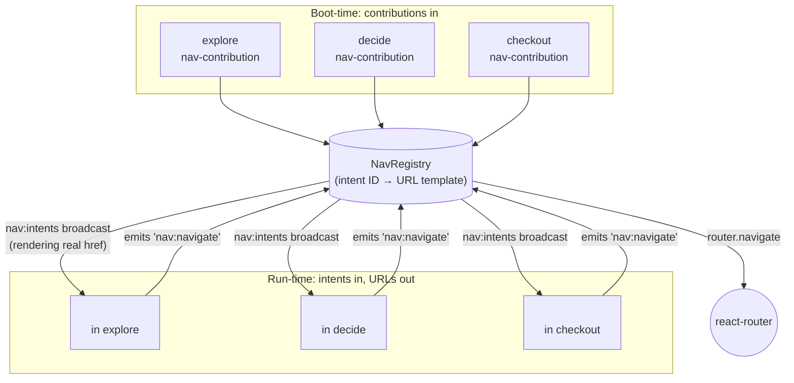
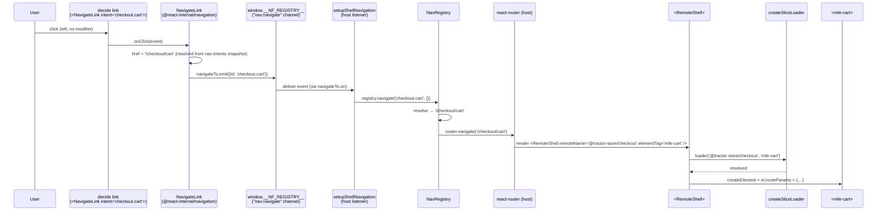

# Navigation

The Tractor Store has *one* router (in the host) and *zero* hard-coded
cross-team URLs in the remotes. A click in `decide` that should land
on the cart never mentions `/checkout/cart` — it emits the **intent**
`checkout.cart` and lets the host figure out the URL.

This document walks through how that works, why the intent system is
the load-bearing piece of the host/remote decoupling, and how a click
in one remote becomes a route activation in another.

## The problem with the obvious solutions

In a naïve micro-frontend setup, remote A linking to remote B picks
one of two bad options:

- **Hard-code the URL.** Now A breaks every time B reorganises its
  routes, and renaming `/checkout` becomes a coordinated multi-team
  migration.
- **Import B's routing module.** Now A and B are build-time coupled,
  share a router instance, and can't deploy independently.

Both options leak B's URL scheme into A. The intent system removes
the leak entirely by letting each remote keep ownership of its URLs
while exposing a stable, public name (the intent) to the rest of the
world.

If you're familiar with Android's deep-link Intents, the model is the
same: the caller names *what* it wants to reach, the platform decides
*where* that lives.

## The contract: `nav-contribution`

Each remote *exposes* (via `federation.config.mjs`) a
`nav-contribution` module. It is a single object describing what the
remote routes (`apps/explore/src/core/nav-contribution.ts`):

```ts
export const navContribution: NavContribution = {
  source: '@tractor-store/explore',
  basePath: 'explore',
  intents: [
    { id: 'home',              path: '/',                    element: 'mfe-home' },
    { id: 'products',          path: '/products',            element: 'mfe-category' },
    { id: 'products.category', path: '/products/{category}', element: 'mfe-category' },
    { id: 'stores',            path: '/stores',              element: 'mfe-stores' },
  ],
  chromeElements: ['mfe-header', 'mfe-footer', 'mfe-recommendations', 'mfe-store-picker'],
};
```

The shape (`libs/navigation/src/lib/nav-types.ts`):

- `source` — the federation remote name.
- `basePath` — the URL prefix the host will mount the remote under
  (`/explore`, `/decide`, `/checkout`).
- `intents[]` — every routable destination the remote owns:
  - `id` — the public name *relative to the remote*. The host
    prepends `basePath` when it registers each intent, so explore's
    `{ id: 'home' }` becomes the public `explore.home`. Other remotes
    link to the full ID, never to a URL.
  - `path` — the path *inside* `basePath`, with optional `{param}`
    segments.
  - `element` — the `mfe-*` custom element to render at that path.
- `chromeElements?` — non-routed custom-element tags this remote
  exposes (e.g. `mfe-header`, `mfe-mini-cart`). The host uses these
  to build the `tag → remoteName` slice index so peers can
  `prefetchElement(tag)` without naming the owning remote. (Routed
  intents' `element` tags are added to the same index automatically.)
- `navBar?` — optional contributions to a shared nav bar (intent ID +
  label + order). The registry exposes a sorted list of them via
  `getNavBar()`; the current build does not render one, but the slot
  is there for teams that want to add menu items without coordinating.

The full intent ID is the only thing that crosses team boundaries.
URLs and element tags are an implementation detail of the owning
team.

## Boot-time wiring

When the host starts, it loads every remote's `nav-contribution` in
parallel and uses them to build its router config and a *registry* of
intents.

The orchestration
(`apps/host/src/app/nav/setup-shell-nav.ts:50`) is small enough to
read in full:

```ts
export const setupShellNavigation = async ({ nf, manifest, fallbackRedirect = '/explore' }) => {
  const loaded = await loadContributions(nf, manifest);
  const remoteRoutes = buildRemoteRoutes(loaded);

  // …wildcard route (empty-state or redirect) omitted for brevity…
  const router = createBrowserRouter([...remoteRoutes, { path: '*', loader: () => redirect(fallbackRedirect) }]);

  const registry = new NavRegistry((url) => router.navigate(url));
  for (const { contribution } of loaded) {
    registry.register(contribution);
  }

  navIntents.emit(registry.getIntents());
  setSliceIndex(buildSliceIndex(loaded));

  navigateTo.on(({ id, payload }) => {
    void registry.navigate(id, payload).catch((err) => {
      console.error(`[nav] navigation to intent "${id}" failed`, err);
    });
  });

  return { router, registry };
};
```

It does five things:

1. **Loads contributions.** `loadContributions`
   (`apps/host/src/app/nav/load-contributions.ts:41`) uses
   `Promise.allSettled` so a broken remote does not break the whole
   shell — it just disappears from the registry with a console warning.
2. **Builds the router.** `buildRemoteRoutes`
   (`apps/host/src/app/nav/remote-routes.tsx:18`) maps each routed
   intent to a react-router `RouteObject` whose `element` is a
   `<RemoteShell remoteName={…} elementTag={…} />`. A `*`-route
   redirects (or renders an empty-state when no remotes loaded).
3. **Builds the `NavRegistry`** and hands it a one-line navigator that
   calls `router.navigate`. The registry holds no React or
   react-router dependency, so it is trivially unit-testable.
4. **Broadcasts the intent map on `nav:intents`** and writes the
   slice index. The intent map lets `<NavigateLink>` render real
   anchor `href`s; the slice index lets `prefetchElement(tag)` work
   without hardcoding remote names.
5. **Subscribes to `nav:navigate`** and listens for click intents.
   Every `<NavigateLink>` click in any remote lands here, gets
   resolved by the registry, and finally hits the router.

The host's `bootstrap.tsx` then renders
`<RouterProvider router={router} />` inside the AppProvider context.
By the time the user sees the first frame the registry is populated
and routing is wired.

## The registry as a hub



Contributions flow into the registry once, at startup. The registry
then broadcasts a snapshot back to the remotes so their links can
render real anchors. After that, every click in every remote routes
through the single host-owned listener. The registry itself never
leaves the host — remotes only ever speak the public intent ID.

## Linking from a remote: `<NavigateLink>`

Remotes never type a URL and never import react-router. They use a
component shipped from `@react-internal/navigation`:

```tsx
<NavigateLink intent="checkout.cart">Cart</NavigateLink>

<NavigateLink intent="decide.product" params={{ id: product.id }}>
  See details
</NavigateLink>
```

The component
(`libs/navigation/src/lib/navigate-link.tsx`) does three things on top
of "emit on click":

```tsx
export function NavigateLink({ intent, params, children, ...rest }: NavigateLinkProps) {
  // 1. Subscribe to the nav:intents map, so href stays in sync.
  useSyncExternalStore(subscribeNavIntents, getNavIntents, getNavIntents);

  // 2. Resolve the intent + params to a real URL right now.
  const href = resolveIntent(intent, params) ?? '#';

  // 3. Intercept plain clicks; let modifier-clicks fall through.
  const onClick = (event: MouseEvent<HTMLAnchorElement>): void => {
    if (event.defaultPrevented) return;
    if (event.button !== 0) return;
    if (event.metaKey || event.ctrlKey || event.shiftKey || event.altKey) return;
    event.preventDefault();
    navigateTo.emit({ id: intent, payload: params ?? {} });
  };

  return <a {...rest} href={href} onClick={onClick}>{children}</a>;
}
```

That listener-side resolution is what makes anchors behave naturally.
A plain left-click is intercepted and converted into a `nav:navigate`
event (no full reload). A middle-click, `Cmd/Ctrl+click`, or "Copy
link address" is *not* intercepted — the real `href` is on the
element, so the browser does the right thing.

`useSyncExternalStore` keeps the resolved `href` reactive: when the
host (re)broadcasts the intent map, every `<NavigateLink>` in every
remote re-renders with the updated URL. A `<NavigateLink>` to an
unknown intent renders with `href="#"` and `onClick` does nothing —
the directive emits nothing and the page does not navigate. The
host-side listener also logs `[nav] cannot navigate to unknown
intent "…"` if an unknown intent ever reaches the bus, so a
half-deployed system fails *visibly in the console* rather than
silently in the URL bar.

### The hook form: `useNavigateTo`

For navigation from event handlers and effects (not anchor clicks),
the same channel is exposed as a stable callback
(`libs/navigation/src/lib/use-navigate-to.ts:11`):

```ts
export const useNavigateTo = () =>
  useCallback((intent: string, params?: NavPayload) => {
    navigateTo.emit({ id: intent, payload: params ?? {} });
  }, []);
```

Use it where a `<NavigateLink>` element isn't appropriate — e.g.
navigating after a successful form submit:

```tsx
const navigateToIntent = useNavigateTo();

const handleSubmit = async (event: FormEvent) => {
  event.preventDefault();
  await placeOrder();
  navigateToIntent('checkout.thanks');
};
```

Both `<NavigateLink>` and `useNavigateTo` end up emitting the same
`nav:navigate` event, so any future feature added at the host
listener (param validation, deep-link auditing, analytics) only needs
to be added once.

## Reading params on the receiving end

Once the host's route activates, `<RemoteShell>` mounts the right
custom element and writes a `routeParams` object onto it
(`apps/host/src/app/RemoteShell.tsx:58`). `defineMfe`'s element class
catches the property write in its setter and re-renders the React
component with `routeParams` as a prop
(`libs/mfe-runtime/src/lib/define-mfe.tsx:72`):

```tsx
// e.g. apps/decide/src/features/product/Product.tsx
export function Product({ routeParams }: { routeParams: RouteParams }) {
  const id  = param(routeParams, 'id');
  const sku = param(routeParams, 'sku');
  // …
}
```

`param`, `requiredParam`, `paramList`, and `sameRouteParams` are tiny
helpers from `libs/url/src/lib/route-params.ts`. They handle the
single-value-vs-array shape (multi-value query params come through
as arrays) and throw helpful errors for missing required params.

## End-to-end: a click in `decide` becomes a URL change



Notice what *isn't* in the diagram: no import from `decide` to
`checkout`, no shared router, no string `'/checkout/cart'` typed
anywhere inside `decide`'s code. The only thing crossing the
boundary is the literal `'checkout.cart'`.

## Resolving params and query strings

Two kinds of parameters can travel with an intent:

- **Path params** — placeholders in the intent's `path`, e.g.
  `/product/{id}`. The registry fills them in from `params`.
- **Query params** — anything in `params` that wasn't consumed by a
  placeholder gets appended as a query string.

The split happens in `NavRegistry.resolve`
(`apps/host/src/app/nav/nav-registry.ts:90`):

```ts
const path = joinPath(intent.basePath, resolveTemplate(intent.path, payload));
const consumed = new Set(splitIntentParams(intent.path));
const queryParams: Record<string, string> = {};
for (const [key, value] of Object.entries(payload)) {
  if (!consumed.has(key)) queryParams[key] = value;
}
return appendQueryString(path, queryParams);
```

So a link like

```tsx
<NavigateLink
  intent="decide.product"
  params={{ id: '123', sku: 'BLUE-XL' }}>
  Open
</NavigateLink>
```

with the contribution `{ id: 'product', path: '/product/{id}', element: 'mfe-product' }`
resolves to `/decide/product/123?sku=BLUE-XL`. The remote then reads
`id` and `sku` off `routeParams` on its component.

`joinPath`, `resolveTemplate`, `splitIntentParams`, and
`appendQueryString` are the path-template helpers from
`@react-internal/url`. They're shared because both the host
(`NavRegistry.resolve`) and the in-remote resolver
(`libs/navigation/src/lib/nav-resolver.ts:43`) need to apply the
*same* template logic.

## What this design buys you

Several payoffs fall out of the design:

- **Independent deploys.** A team can rename `/checkout/cart` to
  `/cart` by editing one path in their own `nav-contribution.ts`. No
  other remote needs to know — `checkout.cart` still resolves, just
  to a different URL.
- **No router import in remotes.** Remotes don't depend on
  `react-router`. The link component ships in a small shared
  library; the actual router lives only in the host.
- **The host owns zero remote-specific knowledge.** It iterates over
  the contributions it loaded and builds routes generically — there
  is no `if (remoteName === 'checkout')` anywhere in the host code.
- **Testable in isolation.** Each remote runs standalone on its own
  port. When `decide` boots on `:4202` it can mount its own
  `mfe-product` (driven by the `?fragment=` query param parsed in
  `main.tsx`); cross-remote prefetches become no-ops when the slice
  index isn't populated, so the page still renders.
- **Standards-friendly.** All cross-app messaging goes through one
  tiny global (`window.__NF_REGISTRY__`). The bus is plain pub/sub;
  the only React-specific pieces are a ~50-line `<NavigateLink>` and
  a one-line `useNavigateTo` hook.

The intent system is what turns "three React apps loaded into one
page" into "three independently-evolving products that happen to
share a shell".

## See also

- [Architecture](./architecture.md) — the runtime and custom-element
  bridge that the navigation layer rides on top of.
- [Features](./features.md) — the full list of intents per team.
